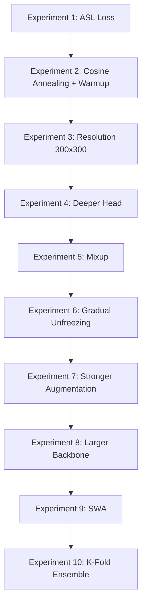

# Plan to Improve Ring Multilabel Classification

## Current Situation Analysis

**Dataset:** 8,346 galaxy images, 80/10/10 split, heavily imbalanced:

- Inner ring positive: ~20% (ring_class 1 + 3 = 1,686)
- Outer ring positive: ~9% (ring_class 2 + 3 = 753)

**Current metrics show precision is the bottleneck** -- too many false positives for both labels. The weighted sampler + focal loss + pos_weight are over-compensating for class imbalance, causing the model to predict "ring" too aggressively.

**Architecture:** Zoobot ConvNeXt Nano (encoder_dim=640) + 2-layer MLP head (640 -> 256 -> 2), trained in 2 stages.

---

## Improvement 1: Replace Focal Loss with Asymmetric Loss (ASL)

**Why:** Asymmetric Loss ([Ridnik et al., 2021](https://arxiv.org/abs/2009.14119)) was designed specifically for multi-label classification with class imbalance. Unlike focal loss which symmetrically down-weights easy examples, ASL applies different focusing parameters to positives (`gamma_pos`) and negatives (`gamma_neg`), plus a hard threshold (`clip`) on negative logits to fully discard very easy negatives. This directly addresses the false positive problem.

**Changes in** `[ring_detection_model.py](ring_detection_model.py)`:

- Add an `_asymmetric_loss` function
- Add constructor parameters: `use_asl: bool`, `asl_gamma_neg: float = 4`, `asl_gamma_pos: float = 0`, `asl_clip: float = 0.05`
- Wire it into `_compute_loss`

```python
def _asymmetric_loss(logits, targets, gamma_neg=4, gamma_pos=0, clip=0.05):
    p = torch.sigmoid(logits)
    # Asymmetric clipping on negative logits
    p_neg = (p + clip).clamp(max=1.0)
    # BCE components
    loss_pos = targets * torch.log(p.clamp(min=1e-8))
    loss_neg = (1 - targets) * torch.log((1 - p_neg).clamp(min=1e-8))
    loss = -(loss_pos + loss_neg)
    # Asymmetric focusing
    if gamma_neg > 0 or gamma_pos > 0:
        pt = p * targets + (1 - p) * (1 - targets)
        gamma = gamma_pos * targets + gamma_neg * (1 - targets)
        loss = loss * (1 - pt).pow(gamma)
    return loss.mean()
```

**Expected impact:** Significantly reduces false positives (improves precision) while maintaining recall. This is the single highest-value change.

---

## Improvement 2: Cosine Annealing LR with Warmup

**Why:** `ReduceLROnPlateau` is reactive and can get stuck in plateaus or reduce too aggressively. Cosine annealing provides smoother convergence and often better final performance, especially for fine-tuning. A warmup phase prevents the encoder from being destabilized early in stage 2.

**Changes in** `[ring_detection_model.py](ring_detection_model.py)` `configure_optimizers()`:

- Replace `ReduceLROnPlateau` with `CosineAnnealingWarmRestarts` or `LinearWarmupCosineAnnealingLR`
- Add a `scheduler_type` parameter to allow A/B testing

```python
from torch.optim.lr_scheduler import CosineAnnealingLR, SequentialLR, LinearLR

warmup = LinearLR(optimizer, start_factor=0.1, total_iters=warmup_epochs)
cosine = CosineAnnealingLR(optimizer, T_max=max_epochs - warmup_epochs, eta_min=1e-7)
scheduler = SequentialLR(optimizer, [warmup, cosine], milestones=[warmup_epochs])
```

---

## Improvement 3: Larger Image Resolution (224 -> 300 or 384)

**Why:** Ring structures are morphological features with subtle spatial details. Higher resolution preserves more of these details. ConvNeXt handles different input sizes natively since it uses global average pooling.

**Changes in** `[main.ipynb](main.ipynb)` and `[datasets.py](datasets.py)`:

- Change `transforms.Resize((224, 224))` to `transforms.Resize((300, 300))` or `(384, 384)` in the pipeline
- May need to reduce batch size to 32 or 48 to fit in GPU memory at 384x384
- Start with 300x300 as a compromise between detail and memory

---

## Improvement 4: Deeper Classification Head

**Why:** The current head (640 -> 256 -> 2) may be too shallow to learn complex decision boundaries. An intermediate layer with residual-like structure can help.

**Changes in** `[ring_detection_model.py](ring_detection_model.py)`:

- Expand head to: 640 -> 512 -> 256 -> 2 with BatchNorm and dropout between layers

```python
head_layers = [
    nn.Dropout(p=dropout_rate),
    nn.Linear(encoder_dim, 512),
    nn.GELU(),
    nn.BatchNorm1d(512),
    nn.Dropout(p=dropout_rate / 2),
    nn.Linear(512, hidden_dim),
    nn.GELU(),
    nn.BatchNorm1d(hidden_dim),
    nn.Dropout(p=dropout_rate / 3),
    nn.Linear(hidden_dim, 2),
]
```

---

## Improvement 5: Mixup Data Augmentation

**Why:** With only ~6,700 training samples, the model is prone to overfitting. Mixup creates synthetic samples by blending pairs of images and their labels, acting as a strong regularizer that is especially effective for small datasets and imbalanced problems.

**Changes in** `[ring_detection_model.py](ring_detection_model.py)` `training_step()`:

- Implement mixup by blending images and labels during training
- Add `mixup_alpha` parameter (suggested: 0.2-0.4)

```python
if self.mixup_alpha > 0 and self.training:
    lam = np.random.beta(self.mixup_alpha, self.mixup_alpha)
    idx = torch.randperm(images.size(0), device=images.device)
    images = lam * images + (1 - lam) * images[idx]
    targets = lam * targets + (1 - lam) * targets[idx]
```

---

## Improvement 6: Gradual Unfreezing

**Why:** Unfreezing the entire encoder at once in stage 2 can cause catastrophic forgetting of pretrained features. Gradually unfreezing from the top layers down gives lower layers time to stabilize.

**Changes in** `[main.ipynb](main.ipynb)` and `[ring_detection_model.py](ring_detection_model.py)`:

- Add a callback or `on_train_epoch_start` hook that progressively unfreezes encoder blocks
- Start by unfreezing only the last 1-2 encoder stages, then unfreeze more every N epochs

---

## Improvement 7: Stronger Augmentation

**Why:** The current augmentation is relatively mild. For astronomical images, more aggressive transforms can help generalization without distorting morphological features.

**Changes in** `[datasets.py](datasets.py)` `get_augmentation_transforms()`:

- Enable `RandomErasing` (currently commented out): `transforms.RandomErasing(p=0.15, scale=(0.02, 0.1))`
- Add Gaussian noise injection
- Increase `ColorJitter` ranges slightly: `brightness=0.15, contrast=0.15, saturation=0.08`
- Consider adding `RandomPerspective` with a small distortion scale for mild perspective variation

---

## Improvement 8: Larger Backbone (ConvNeXt Small)

**Why:** ConvNeXt Nano may lack capacity for distinguishing subtle ring features. The Zoobot project offers larger variants.

**Changes in** `[main.ipynb](main.ipynb)`:

- Check if `mwalmsley/zoobot-encoder-convnext_small` is available on HuggingFace
- If available, swap the encoder and update `encoder_dim` accordingly (ConvNeXt Small has encoder_dim=768)
- This increases training time significantly but may improve feature quality

---

## Improvement 9: Stochastic Weight Averaging (SWA)

**Why:** SWA averages model weights over the final portion of training, leading to flatter minima and better generalization. Easy to add via PyTorch Lightning's `StochasticWeightAveraging` callback.

**Changes in** `[main.ipynb](main.ipynb)`:

```python
from pytorch_lightning.callbacks import StochasticWeightAveraging
swa = StochasticWeightAveraging(swa_lrs=1e-5, swa_epoch_start=0.7)
```

---

## Improvement 10: K-Fold Cross-Validation Ensemble

**Why:** With a small dataset, a single train/val split may not be representative. Training 5 models on different folds and ensembling predictions at test time can give a significant F1 boost (typically 1-3 points).

**Changes:** Add a k-fold training loop in the notebook, save all fold models, and average their sigmoid probabilities at inference time.

---

## Recommended Experiment Order

Run these experiments incrementally, keeping the best configuration from each step:




Each experiment should be compared against the current best using the same val set and threshold tuning procedure. Keep changes that improve val F1-macro and show decreasing val_loss during training.

---

## Also Consider: Tuning the WeightedRandomSampler

The current sampler uses pure inverse-frequency weights, which may over-represent rare classes. Consider reducing sampler aggressiveness by using `sqrt(1/freq)` instead of `1/freq` for sample weights. This combined with ASL could significantly cut down false positives.